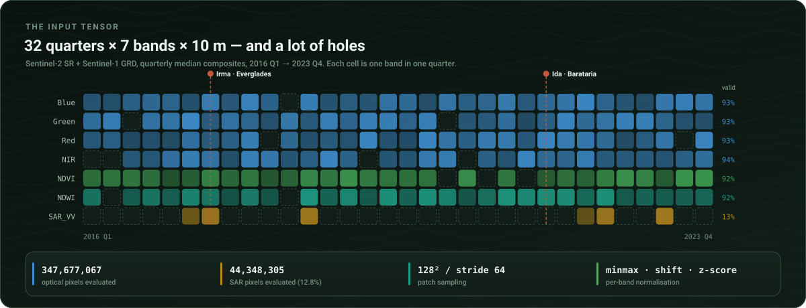
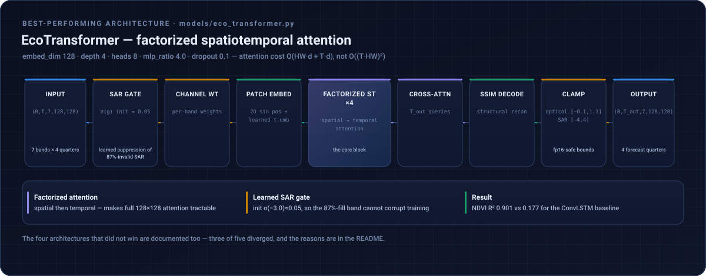
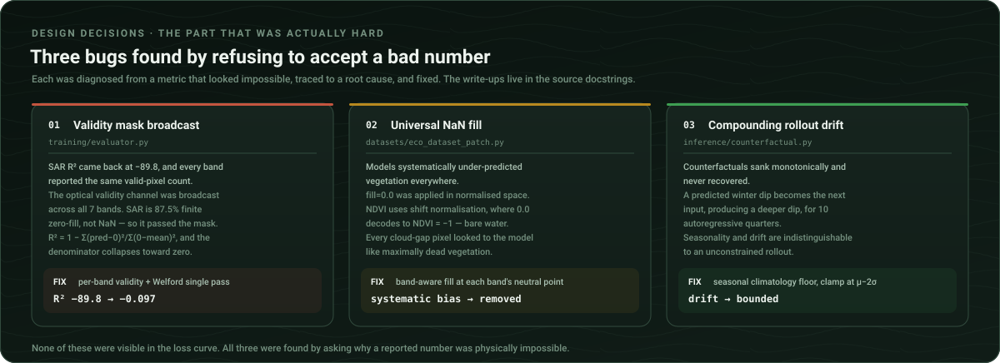
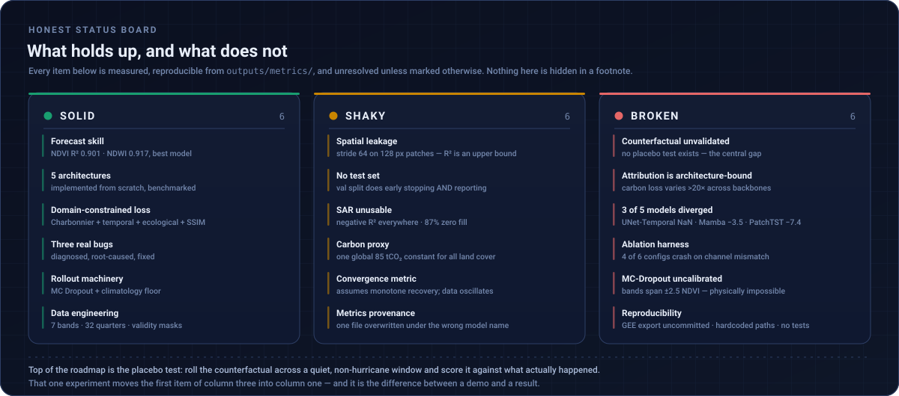

<div align="center">



<br/>

[](https://www.python.org/)
[](https://pytorch.org/)
[](https://earthengine.google.com/)
[](https://sentinels.copernicus.eu/)
[](LICENSE)


</div>

---

## Contents

| | | |
|---|---|---|
| [**The Problem**](#the-problem) | [**Why It's Hard**](#why-its-hard) | [**How It Works**](#how-it-works) |
| [**Results**](#results) | [**Attribution Sensitivity**](#attribution-sensitivity) | [**Results Gallery**](#results-gallery) |
| [**Architectures**](#model-architectures) | [**Design Decisions**](#design-decisions) | [**Project Status**](#project-status) |
| [**Getting Started**](#getting-started) | [**Limitations**](#known-limitations) | [**Roadmap**](#roadmap) |

---

## The Problem

When Hurricane Irma crossed the Everglades in 2017, satellites recorded a sharp drop in vegetation index. But **how much of that drop was the hurricane?**

Wetland NDVI swings hard with season, drought, salinity, and inter-annual climate variability. A raw before/after comparison conflates all of it. To attribute damage to the storm you need the one thing that does not exist: **the counterfactual** — the trajectory the ecosystem *would* have followed in a world without the storm.



### Case Studies

| Site | Ecosystem | Disturbance | Event quarter | Post-event quarters |
|---|---|---|---|---|
| **Everglades**, FL | Freshwater marsh / mangrove | **Hurricane Irma** (Sep 2017) | Q3 2017 (`t=6`) | 10 |
| **Barataria Bay**, LA | *Spartina* salt marsh | **Hurricane Ida** (Aug 2021) | Q4 2021 (`t=23`) | 9 |

---

## Why It's Hard

This is not a supervised benchmark. Four properties make it genuinely difficult, and they shaped every design decision below:

1. **No ground truth, ever.** The counterfactual is unobservable by construction. There is no test-set loss to compute against it — validation has to be indirect.
2. **Autoregressive drift.** Rolling forward 10 quarters compounds error. Early runs sank into a permanent "winter dip" because each predicted low-NDVI frame became the next input.
3. **Heavily corrupted observations.** Cloud gaps leave NaNs across large fractions of optical quarters, and SAR is valid on just **12.8%** of pixels. Naïve fill values silently poison both the loss and the metrics.
4. **The signal is small.** Storm ΔNDVI is ~0.05–0.35 against seasonal swings of comparable magnitude. Modest modelling errors are the same size as the effect being measured.



<sub>Per-band coverage rates are measured from the evaluation run; the individual cell placement in this diagram is illustrative, not the literal per-quarter mask.</sub>

---

## How It Works



The counterfactual rollout is the heart of it (`inference/counterfactual.py`):

1. Feed the model the **four quarters immediately before** the hurricane as context.
2. Predict forward autoregressively across the full post-event horizon, **never** feeding it observed post-storm data.
3. Repeat **50×** with dropout active (MC Dropout) for a mean trajectory and per-pixel spread.
4. Clamp each step to a **seasonal climatology floor** (μ − 2σ of pre-event same-quarter statistics) to stop compounding drift.
5. Stitch patch predictions back to full resolution and inverse-normalise to physical units.

---

## Results



| Model | NDVI | NDWI | NIR | Red | Green | Blue | SAR_VV | RMSE | Best val loss | Train time |
|---|---|---|---|---|---|---|---|---|---|---|
| 🥇 **EcoTransformer** | **0.901** | **0.917** | **0.877** | **0.836** | **0.833** | 0.559 | −0.097 | **0.1586** | **2.198** | 6h 10m |
| 🥈 **ConvLSTM** *(baseline)* | 0.177 | 0.772 | 0.865 | 0.818 | 0.790 | **0.684** | **0.173** | 0.1568 | — | — |
| ❌ UNet-Temporal | NaN | NaN | NaN | NaN | NaN | NaN | NaN | NaN | — | — |
| ❌ UNet-Mamba | −3.51 | −1.19 | −23.1 | −269 | −347 | −680 | −6.34 | 0.6650 | 2.259 | 8h 57m |
| ❌ UNet-PatchTST | −7.40 | −3.75 | −11.2 | −242 | −203 | −119 | −9.39 | 0.6635 | 2.348 | 3h 49m |

> [!IMPORTANT]
> Patches are 128 px sampled at stride 64, so neighbours overlap 50% and the train/val split is patch-level random. Train and validation patches share pixels — **R² = 0.901 is an optimistic upper bound** until the split is redone on disjoint spatial blocks. See [Limitations](#known-limitations).

**Three of five architectures failed to converge**, reported here deliberately rather than hidden. The diagnostic point: UNet-Mamba and UNet-PatchTST reached validation losses (2.26, 2.35) within ~7% of the winner (2.20), yet produce catastrophically negative R². The composite loss is satisfiable by a degenerate near-constant predictor, so **validation loss alone is not a usable model-selection signal on this task**.

### Counterfactual Agreement & Damage Extent

Post-event counterfactual vs. observed NDVI, EcoTransformer:

| Site | CF-vs-actual R² | Pixels damaged (ΔNDVI > 0.05) | Q1 impacted area |
|---|---|---|---|
| **Everglades** (Irma) | 0.821 | 23.7% | 4,041 ha |
| **Barataria Bay** (Ida) | 0.858 | 36.6% | 9,905 ha (21.6%) |

---

## Attribution Sensitivity



| Site | Model | Peak impacted area (ha) | Carbon loss (tCO₂-eq) | Gap-closing rate /quarter |
|---|---|---|---|---|
| **Everglades** | EcoTransformer | 6,116 | 50,332 | +0.0055 |
| Everglades | UNet-Mamba | 4,089 | 34,113 | +0.0023 |
| Everglades | UNet-Temporal | 31,812 | 698,259 | +0.0302 |
| **Barataria Bay** | EcoTransformer | 21,612 | 146,458 | −0.0013 |
| Barataria Bay | UNet-Mamba | 23,417 | 149,006 | −0.0070 |
| Barataria Bay | UNet-Temporal | 37,836 | 1,006,257 | −0.0008 |

> [!WARNING]
> **This is the most important result in the project, and it is a negative one.** Learned counterfactual attribution here is dominated by architecture choice, not by the geophysical signal. No single damage figure from this class of method — the best model's included — should be quoted as an estimate of real-world impact.

<sub><b>Provenance note:</b> an early run overwrote <code>everglades_convlstm_metrics.json</code> with UNet-Temporal values. This is visible in panels A/B of the model-comparison figure below, where the ConvLSTM and UNet-Tem bars are <i>identical</i>. Only unambiguously-suffixed metrics files feed the table above.</sub>

---

## Results Gallery

### Multi-Model Impact Comparison

<div align="center">

</div>

<sub><b>A</b> vegetation-loss area and <b>B</b> carbon-stock loss diverge by more than an order of magnitude across backbones. <b>C</b> recovery speed flips sign between sites. Radar plots score area consistency, carbon precision, recovery speed, temporal coherence, NDVI R². <b>E</b> reports time-to-recovery as 0 quarters for every model — a broken metric, not a finding (Limitation 9).</sub>

### Damage Attribution — Actual vs. Counterfactual vs. Δ

<table>
<tr>
<td width="50%"><sub><b>Everglades · EcoTransformer.</b> Observed post-Irma NDVI, the no-hurricane counterfactual, and the per-pixel damage map.</sub></td>
<td width="50%"><sub><b>Barataria Bay · EcoTransformer.</b> 21.6% of the scene impacted (9,905 ha) in the first post-Ida quarter.</sub></td>
</tr>
<tr>
<td width="50%"><sub><b>Everglades · UNet-Mamba.</b> Same scene, different backbone — a visual control against the panel above.</sub></td>
<td width="50%"><sub><b>Barataria Bay · UNet-Mamba.</b> Spatial pattern broadly agrees with EcoTransformer; the aggregate totals do not.</sub></td>
</tr>
</table>

### Temporal Evolution — Full Recovery Horizon

<div align="center">

<sub><b>Barataria Bay · EcoTransformer.</b> Row 1: pre-event context (t−4 … t−1). Row 2: counterfactual rollout. Row 3: observed. Row 4: per-pixel ΔNDVI. Note the cloud-gap holes in row 1 — the model receives a heavily masked context.</sub>
</div>

<br/>

<table>
<tr>
<td width="50%"><sub><b>Everglades · EcoTransformer.</b></sub></td>
<td width="50%"><sub><b>Everglades · UNet-Mamba.</b></sub></td>
</tr>
<tr>
<td width="50%"><sub><b>Barataria Bay · UNet-Mamba.</b></sub></td>
<td width="50%"><sub><b>Barataria Bay dashboard.</b> CF-vs-actual R² = 0.858, 36.6% pixels damaged. Converged models agree closely on carbon here (146,458 vs 149,006).</sub></td>
</tr>
</table>

<div align="center">

<sub><b>Everglades health dashboard.</b> Carbon-stock loss by model, vegetation-loss area over time, ΔNDVI damage distribution (23.7% damaged), CF-vs-actual agreement (R² = 0.821), and per-band spatial deltas.</sub>
</div>

### Recovery Trajectories & Uncertainty

<table>
<tr>
<td width="50%"><sub><b>Everglades · UNet-Mamba.</b> Counterfactual sits consistently above observed — a persistent positive damage gap of 0.02–0.06 NDVI.</sub></td>
<td width="50%"><sub><b>Barataria Bay · UNet-Mamba.</b> The damage gap oscillates in sign rather than closing — the direct cause of the broken convergence metric.</sub></td>
</tr>
</table>

> [!CAUTION]
> **The shaded MC-Dropout bands in both panels span roughly ±2.5 NDVI**, far outside the physically possible range of [−1, 1]. Those intervals are uncalibrated and not currently usable (Limitation 10). The mean trajectories and ΔNDVI panels are the interpretable parts.

<div align="center">

<sub><b>Everglades, calendar-quarter view.</b> The damage gap is positive through 2018 (red) then <b>flips negative</b> from 2019 (green). A monotone-recovery assumption cannot describe this — which is why time-to-convergence returns 0.</sub>
</div>

### Ablation Study *(partially broken — shown unretouched)*

<div align="center">

<sub><b>Only 2 of 6 configurations completed.</b> <code>full</code>, <code>no_eco_loss</code>, <code>no_temp_loss</code>, and <code>single_eco</code> crash on a channel-count mismatch, leaving empty bars. Of what ran: dropping SAR costs little, while NDVI-only input degrades reconstruction MSE ~4× (0.193 → 0.750) — the multispectral context carries real predictive signal.</sub>
</div>

---

## Model Architectures



<details open>
<summary><b>🥇 EcoTransformer</b> — factorized spatiotemporal attention <i>(best performing)</i></summary>

<br/>

`models/eco_transformer.py` · `embed_dim=128, depth=4, heads=8, mlp_ratio=4.0, dropout=0.1`

Factorizing attention into separate spatial and temporal passes keeps cost at `O(HW·d + T·d)` instead of `O((T·HW)²)`, making full 128×128 attention tractable. The learned **SAR input gate** (initialised at σ(−3.0) ≈ 0.05) lets the model suppress the mostly-invalid SAR channel rather than be corrupted by it.

</details>

<details>
<summary><b>ConvLSTM</b> — recurrent convolutional baseline</summary>

<br/>

`models/convlstm.py` · `hidden_channels=[96,96,64], kernel=3, dropout=0.1`

Classic Shi et al. encoder–decoder ConvLSTM. The **only** model with positive SAR R² (0.173), yet it collapses on NDVI (0.177) — it tracks raw reflectance well while failing on the derived index that actually matters.

</details>

<details>
<summary><b>UNet-Temporal</b> — U-Net encoder + LSTM bottleneck + attention</summary>

<br/>

`models/unet_temporal.py` · `encoder=[32,64,128,256], lstm_hidden=512, heads=8`

Spatial U-Net encoder, temporal LSTM at the bottleneck with multi-head attention, skips into the decoder. **Failed to produce finite evaluation metrics.** Its counterfactuals are finite but wildly overestimate damage (698k tCO₂), consistent with an unstable rollout.

</details>

<details>
<summary><b>UNet-Mamba</b> — selective state-space bottleneck</summary>

<br/>

`models/unet_mamba.py` · `d_state=16, expand=2, n_layers=2, dropout=0.15, lr=1e-5`

Mamba selective SSM blocks for linear-time sequence modelling. **Diverged** despite a reduced learning rate — R² −3.5 on NDVI, −680 on blue. The blue-band collapse suggests the SSM latched onto a near-constant output for low-variance channels. Its *spatial* damage patterns still look plausible, which is its own caution: reasonable-looking maps do not imply a converged model.

</details>

<details>
<summary><b>UNet-PatchTST</b> — patch-based temporal transformer bottleneck</summary>

<br/>

`models/unet_patchtst.py` · `patch_len=2, stride=1, layers=3, heads=4, lr=2e-5`

Channel-independent temporal patching at the bottleneck. **Diverged** (NDVI R² −7.4). With only `T_in=4` timesteps, `patch_len=2` leaves 3 temporal tokens — almost certainly too few for the patching inductive bias to pay off.

</details>

---

## Design Decisions



<details open>
<summary><b>🐛 Per-band validity masking</b> — fixed R² = −89 on SAR</summary>

<br/>

**Symptom:** NDVI R² = −2.27, SAR R² = −89.8. All bands reported identical valid-pixel counts (347,677,067) — including SAR, which should show ~44M.

**Root cause** (`training/evaluator.py`): the evaluator broadcast the single *optical* validity channel across all seven bands via `validity.expand_as(target)`. SAR is 87.5% **finite zero fill**, not NaN — so it passed the optical mask. R² became `1 − Σ(pred − 0)² / Σ(0 − mean)²`, with a denominator collapsing toward zero.

**Fix:** per-band validity — optical bands use the optical channel; SAR uses `(|target_sar| > 0.05) AND optical_valid`, since genuine backscatter is never exactly zero. Switched to single-pass **Welford** mean/variance so no stale batch mean contaminates the total sum of squares.

</details>

<details open>
<summary><b>🐛 Band-aware NaN fill</b> — fixed a catastrophic NDVI bias</summary>

<br/>

**Symptom:** models systematically under-predicting vegetation.

**Root cause** (`datasets/eco_dataset_patch.py`): a universal `fill=0.0` applied in *normalised* space. For minmax-normalised optical bands 0.0 is plausibly neutral — but NDVI uses `shift` normalisation, where **0.0 decodes to NDVI = −1**, the physical extreme of bare water. Every cloud-gap pixel looked like maximally dead vegetation.

**Fix:** per-band fill values computed so each band's fill decodes to its physical neutral point.

</details>

<details>
<summary><b>🌡️ Seasonal climatology floor</b> — stops autoregressive drift</summary>

<br/>

A 10-quarter rollout compounds error. Early counterfactuals drifted monotonically downward — a predicted winter dip became the next input, producing a deeper dip, until the trajectory bottomed out and never recovered.

**Fix** (`inference/counterfactual.py`): clamp each step to `μ − 2σ` of pre-event statistics *for that same calendar quarter*. Seasonality is preserved; unbounded drift is not.

</details>

<details>
<summary><b>📉 Composite domain-constrained loss</b></summary>

<br/>

`models/losses.py` — `EcoRewindLoss`:

| Term | Weight | Purpose |
|---|---|---|
| **Charbonnier** reconstruction | 1.0 | Robust L1/L2 hybrid, `ε=1e-2` — tolerant of outlier pixels from residual cloud |
| **Temporal smoothness** | 0.20 | Penalises implausible quarter-to-quarter jumps |
| **Ecological constraints** | 0.10 | Hard physical bounds: NDVI/NDWI ∈ [−1,1], reflectance ∈ [0,1] |
| **SSIM** | 0.10 | Structural fidelity — spatial pattern, not just per-pixel error |

SSIM is **linearly warmed up over 20 epochs**. Applied from epoch 0 it dominates gradients before the model produces coherent structure, and training stalls.

</details>

<details>
<summary><b>🔬 Patch sampling & validity screening</b></summary>

<br/>

128×128 patches at stride 64, with rejection criteria: `nan_threshold=0.15`, `min_valid_coverage=0.30`, `ndvi_var_threshold=5e-4` (rejects flat patches), `min_high_signal_frac=0.40`. Balanced sampling across ecosystems so the larger site does not dominate joint training.

</details>

---

## Project Status



---

## Getting Started

```bash
git clone https://github.com/DAISHINKAN7/EcoRewind.git
cd EcoRewind
python -m venv venv && source venv/bin/activate
pip install -r requirements.txt
```

Point `configs/config.yaml` at your data root:

```yaml
data:
  mode: "local"
  local_root: "/path/to/EcoRewind_Data"   # ← edit this
```

Expected layout — quarterly 7-band GeoTIFFs per site:

```
EcoRewind_Data/
├── Everglades/       # 32 quarterly composites
└── Mississippi_v2/   # 32 quarterly composites
```

> [!NOTE]
> The Google Earth Engine export script is **not yet committed**. Until it is, reproducing from raw imagery requires re-deriving the export; `scripts/validate_mississippi_v2.py` documents the acceptance criteria yours must satisfy.

```bash
python scripts/01_build_tensors.py              # GeoTIFFs → tensors
python scripts/07_train_eco_transformer.py      # train one model
python scripts/train_all.py                     # …or the full sweep
python scripts/04b_generate_all_counterfactuals.py
python scripts/05_compute_metrics.py            # ecological attribution
python scripts/viz_01_damage_comparison.py      # publication figures
python scripts/viz_05_ecosystem_health_dashboard.py
```

Training: 150 epochs max, batch size 4 with 4× gradient accumulation (effective 16), LR 3e-5 with 15-epoch warmup, early stopping patience 30, gradient clipping 1.0. W&B logging on by default.

<details>
<summary><b>Repository structure</b></summary>

```
EcoRewind/
├── assets/                          # the SVG diagrams in this README
├── configs/config.yaml              # single source of truth
├── data/
│   ├── loaders/composite_loader.py  # GeoTIFF → array, cloud/NaN handling
│   └── preprocessing/               # tensors · normalisation · validity · patches
├── datasets/                        # windows, augmentation, band-aware fill
├── models/
│   ├── eco_transformer.py           # ⭐ factorized spatiotemporal attention
│   ├── convlstm.py  unet_temporal.py  unet_mamba.py  unet_patchtst.py
│   └── losses.py                    # EcoRewindLoss composite objective
├── training/
│   ├── trainer.py                   # AMP, grad accum, warmup, early stopping, W&B
│   └── evaluator.py                 # per-band validity-masked R² (Welford)
├── inference/
│   ├── counterfactual.py            # rollout + MC Dropout + climatology floor
│   └── metrics.py                   # impacted area, carbon, recovery, convergence
├── scripts/                         # 01…09 pipeline + viz_01…05 figures
└── outputs/{metrics,maps,logs}/     # all quantitative results and figures
```

</details>

---

## Known Limitations

Deliberately detailed. Every item is measured and unresolved — together they define what this prototype is not.

> [!CAUTION]
> **1 · The counterfactual is never validated.** The central scientific gap. No placebo test exists in the repository. The standard remedy — roll the model across a *quiet, non-hurricane* window and score the "counterfactual" against actually-observed data — has not been run. Until it is, every damage and carbon figure here is an unvalidated model output, not a measurement.

> [!CAUTION]
> **2 · Attribution estimates are architecture-dominated.** Carbon loss varies >20× across backbones on identical inputs. No figure from this pipeline should be quoted as real-world damage.

**3 · Spatial leakage in the validation split.** 128 px patches at stride 64 (50% overlap), split by patch-level random shuffle. Train and validation patches share pixels; all R² values are optimistic upper bounds. Fix: disjoint spatial blocks, or stride ≥ 128.

**4 · No held-out test set.** The validation split does both early stopping and reporting, so metrics are selection-biased.

**5 · Three of five architectures diverged.** UNet-Temporal produces NaN metrics; Mamba and PatchTST have strongly negative R². Causes are hypothesised above but unconfirmed.

**6 · The ablation study is broken.** Four of six experiments crash with a channel-count mismatch (`expected 72 channels, got 66/71`) — the model isn't rebuilt when bands are dropped. Conclusions about loss-term contributions cannot be drawn.

**7 · SAR contributes nothing.** Negative R² for every converged model. At 87.2% zero fill the band is effectively noise; it should be repaired or dropped with justification.

**8 · Carbon conversion is a coarse linear proxy.** `carbon_factor: 85.0` tCO₂ per unit ΔNDVI per hectare, applied uniformly across marsh, mangrove, and open water — classes whose real carbon density varies by an order of magnitude. Treat tCO₂ as a relative index, not an inventory.

**9 · Convergence detection is unreliable.** `time_to_convergence_quarters = 0` for every model, because the CF–actual gap oscillates in sign rather than closing. The metric assumes monotone recovery; the data does not oblige.

**10 · MC-Dropout intervals are uncalibrated.** Bands span roughly **±2.5 NDVI**, exceeding the index range by an order of magnitude — dropout variance is evidently not scaled correctly on inverse-transform.

**11 · Reproducibility gaps.** GEE export uncommitted; `configs/config.yaml` retains a hardcoded development path; no test suite; checkpoints gitignored; one metrics file overwritten under the wrong model name.

---

## Roadmap

Ordered by scientific value per unit effort.

- [ ] **Placebo validation** — roll counterfactuals over quiet pre-event windows, score against observed. *The single highest-value experiment; it converts the method from unfalsifiable to validated.*
- [ ] **Disjoint spatial-block splits** — re-report all R² without pixel leakage.
- [ ] **Fix the ablation harness** — rebuild the model per band configuration so all six configs run.
- [ ] **Calibrate MC-Dropout intervals** — trace variance through inverse-normalisation; add a coverage check.
- [ ] **Held-out test set** distinct from the early-stopping split.
- [ ] **Diagnose the three divergent architectures** — LR sweeps, per-term loss logging, gradient-norm traces.
- [ ] **Repair or remove SAR** — temporal interpolation over the 87% gap, or drop with justification.
- [ ] **Replace the convergence metric** with one tolerating non-monotone recovery.
- [ ] **Land-cover-aware carbon factors** replacing the single global constant.
- [ ] **Commit the GEE export script** + de-hardcode paths.
- [ ] **📊 Interactive web report** — deployable site with an explorable counterfactual map (site / band / quarter selectors, split-view actual-vs-counterfactual, model switcher).

---

## Citation

```bibtex
@software{ajgaonkar_ecorewind_2026,
  author = {Ajgaonkar, Kunal},
  title  = {EcoRewind: Counterfactual Ecosystem Forecasting for
            Hurricane Impact Attribution},
  year   = {2026},
  url    = {https://github.com/DAISHINKAN7/EcoRewind}
}
```

**Related work** — Shi et al. (2015) *ConvLSTM* · Gu & Dao (2023) *Mamba* · Nie et al. (2023) *PatchTST* · Gao et al. (2022) *Earthformer*

---

<div align="center">

**Kunal Ajgaonkar** · Symbiosis Institute of Technology, Pune

Built with Sentinel-1/2 imagery via Google Earth Engine. Copernicus data © ESA.

<sub>Research prototype. Results are not validated for operational or policy use — see <a href="#known-limitations">Known Limitations</a>.</sub>

</div>
