<div align="center">

# 🌪️ EcoRewind

### Counterfactual Ecosystem Forecasting for Hurricane Impact Attribution

**_What would this wetland have looked like if the hurricane had never happened?_**

[](https://www.python.org/)
[](https://pytorch.org/)
[](https://earthengine.google.com/)
[](https://sentinels.copernicus.eu/)
[](LICENSE)

<br/>


-0EA5E9?style=flat-square)
-0EA5E9?style=flat-square)


<br/>

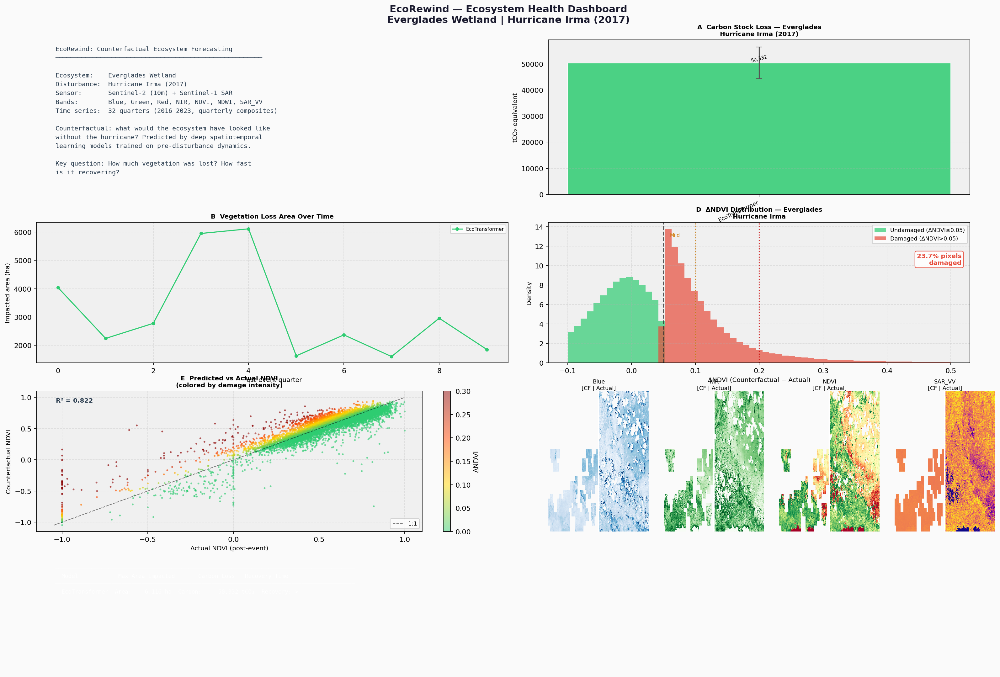

<sub><b>Everglades × Hurricane Irma (2017)</b> — carbon-stock loss by model, vegetation-loss area over time, ΔNDVI damage distribution (23.7% of pixels damaged), counterfactual-vs-actual agreement (R² = 0.821), and per-band spatial deltas.</sub>

</div>

---

## Table of Contents

- [The Problem](#the-problem)
- [Why This Is Hard](#why-this-is-hard)
- [How It Works](#how-it-works)
- [Results](#results)
- [Results Gallery](#results-gallery)
- [Model Architectures](#model-architectures)
- [Design Decisions](#design-decisions)
- [Data Pipeline](#data-pipeline)
- [Repository Structure](#repository-structure)
- [Getting Started](#getting-started)
- [Known Limitations](#known-limitations)
- [Roadmap](#roadmap)
- [Citation](#citation)

---

## The Problem

When Hurricane Irma crossed the Everglades in 2017, satellites recorded a sharp drop in vegetation index. But **how much of that drop was the hurricane?**

Wetland NDVI swings hard with season, drought, salinity, and inter-annual climate variability. A raw before/after comparison conflates all of it. To attribute damage to the storm you need the one thing that does not exist: **the counterfactual** — the trajectory the ecosystem *would* have followed in a world without the storm.

EcoRewind learns that counterfactual. It trains deep spatiotemporal models on pre-disturbance ecosystem dynamics, then rolls them forward *through* the hurricane window without ever showing them the storm. The gap between the model's counterfactual and what actually happened is the attributed impact.

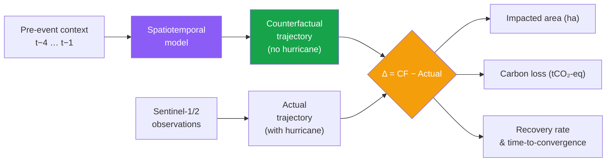

### Case Studies

| Site | Ecosystem | Disturbance | Event quarter | Post-event quarters |
|---|---|---|---|---|
| **Everglades**, FL | Freshwater marsh / mangrove | **Hurricane Irma** (Sep 2017) | Q3 2017 (`t=6`) | 10 |
| **Barataria Bay**, LA | *Spartina* salt marsh | **Hurricane Ida** (Aug 2021) | Q4 2021 (`t=23`) | 9 |

---

## Why This Is Hard

This is not a supervised benchmark. Four properties make it genuinely difficult, and they shaped every design decision below:

1. **No ground truth, ever.** The counterfactual is unobservable by construction. You cannot compute a test-set loss against it. Validation has to be indirect.
2. **Autoregressive drift.** Rolling a model forward 10 quarters compounds error. Early experiments drifted into a permanent "winter dip" because each predicted low-NDVI frame became the next input.
3. **Heavily corrupted observations.** Cloud gaps leave NaNs across large fractions of optical quarters. SAR is only valid on **12.8%** of pixels (44.3M of 347.7M). Naïve fill values silently poison both the loss and the metrics.
4. **The signal is small.** Storm ΔNDVI is ~0.05–0.35 against seasonal swings of comparable magnitude. Modest modelling errors are the same size as the effect being measured.

---

## How It Works

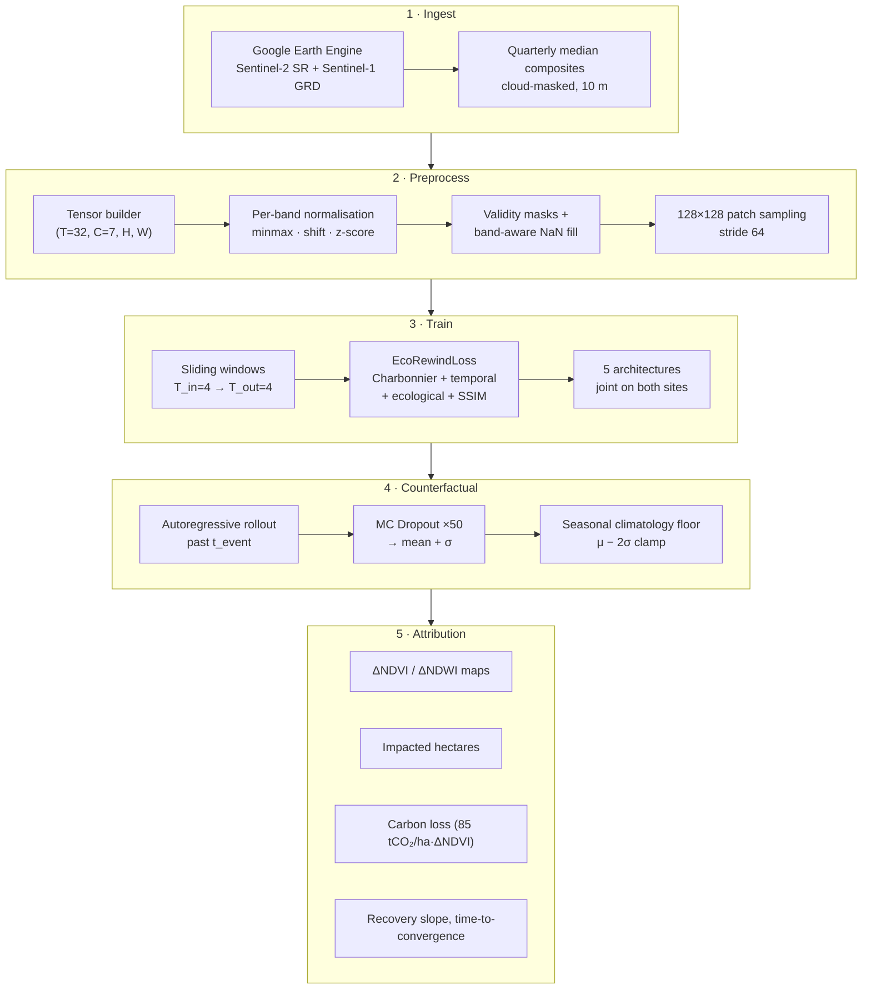

The counterfactual rollout is the heart of it (`inference/counterfactual.py`):

1. Feed the model the **four quarters immediately before** the hurricane as context.
2. Predict forward autoregressively for the full post-event horizon, **never** feeding it observed post-storm data.
3. Repeat **50×** with dropout active (MC Dropout) to get a mean trajectory and a per-pixel spread.
4. Clamp each step to a **seasonal climatology floor** (μ − 2σ of pre-event same-quarter statistics) to stop compounding drift.
5. Stitch patch predictions back to full resolution and inverse-normalise to physical units.

---

## Results

### Forecast Skill — Joint Evaluation (held-out patches, both ecosystems)

Per-band R² for next-window prediction. Validity-masked per band, single-pass Welford accumulation.

| Model | NDVI | NDWI | NIR | Red | Green | Blue | SAR_VV | RMSE | Best val loss | Train time |
|---|---|---|---|---|---|---|---|---|---|---|
| 🥇 **EcoTransformer** | **0.901** | **0.917** | **0.877** | **0.836** | **0.833** | 0.559 | −0.097 | **0.1586** | **2.198** | 6h 10m |
| 🥈 **ConvLSTM** *(baseline)* | 0.177 | 0.772 | 0.865 | 0.818 | 0.790 | **0.684** | **0.173** | 0.1568 | — | — |
| ❌ UNet-Temporal | NaN | NaN | NaN | NaN | NaN | NaN | NaN | NaN | — | — |
| ❌ UNet-Mamba | −3.51 | −1.19 | −23.1 | −269 | −347 | −680 | −6.34 | 0.6650 | 2.259 | 8h 57m |
| ❌ UNet-PatchTST | −7.40 | −3.75 | −11.2 | −242 | −203 | −119 | −9.39 | 0.6635 | 2.348 | 3h 49m |

<sub>Valid pixels: 347,677,067 (optical) · 44,348,305 (SAR). Source: <code>outputs/metrics/*_joint_eval.json</code>.</sub>

> [!IMPORTANT]
> **Read these numbers with the caveat in [Known Limitations](#known-limitations).** Patches are 128 px sampled at stride 64, so neighbouring patches overlap 50% and the train/val split is patch-level random. Train and validation patches share pixels — **R² = 0.901 is optimistic** and should be treated as an upper bound until the split is redone on disjoint spatial blocks.

**Three of five architectures failed to converge**, and that is reported here deliberately rather than hidden. Note the diagnostic gap: UNet-Mamba and UNet-PatchTST reached validation losses (2.26, 2.35) within ~7% of the winning EcoTransformer (2.20), yet produce catastrophically negative R². The composite loss is dominated by terms that a degenerate near-constant predictor can satisfy, so **validation loss alone is not a usable model-selection signal on this task** — per-band R² is.

### Counterfactual Agreement & Damage Extent

Post-event counterfactual vs. observed NDVI, EcoTransformer:

| Site | CF-vs-actual R² | Pixels classed damaged (ΔNDVI > 0.05) | Q1 impacted area |
|---|---|---|---|
| **Everglades** (Irma) | 0.821 | 23.7% | 4,041 ha |
| **Barataria Bay** (Ida) | 0.858 | 36.6% | 9,905 ha (21.6%) |

### Attribution Sensitivity — The Headline Finding

The same counterfactual pipeline, differing only in backbone, yields wildly different damage estimates:

| Site | Model | Peak impacted area (ha) | Carbon loss (tCO₂-eq) | Gap-closing rate /quarter |
|---|---|---|---|---|
| **Everglades** | EcoTransformer | 6,116 | 50,332 | +0.0055 |
| Everglades | UNet-Mamba | 4,089 | 34,113 | +0.0023 |
| Everglades | UNet-Temporal | 31,812 | 698,259 | +0.0302 |
| **Barataria Bay** | EcoTransformer | 21,612 | 146,458 | −0.0013 |
| Barataria Bay | UNet-Mamba | 23,417 | 149,006 | −0.0070 |
| Barataria Bay | UNet-Temporal | 37,836 | 1,006,257 | −0.0008 |

> [!WARNING]
> **Carbon-loss estimates vary by more than 20× across backbones on the same site and the same input data** (34,113 → 698,259 tCO₂-eq for the Everglades). This is the most important result in the project, and it is a negative one: **learned counterfactual attribution is dominated by architecture choice, not by the geophysical signal.** Any single headline damage figure from this class of method — including from the best model here — should be treated as unvalidated. The two converged models agree within ~1.5× on Barataria Bay; the diverged model does not.

<sub><b>Note on provenance:</b> an early run overwrote <code>everglades_convlstm_metrics.json</code> with UNet-Temporal values. This is visible in the ConvLSTM and UNet-Tem bars of panels A and B below, which are <i>identical</i> — the visual signature of the overwrite. Only unambiguously-suffixed metrics files are used in the table above.</sub>

---

## Results Gallery

### Multi-Model Impact Comparison

<div align="center">
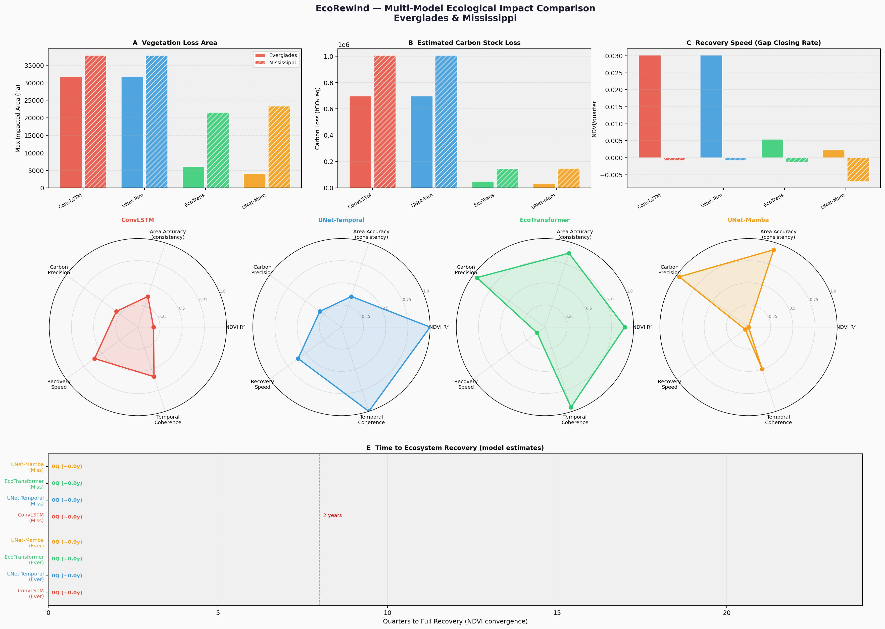
</div>

<sub><b>The attribution-sensitivity result in one figure.</b> <b>A</b> vegetation-loss area and <b>B</b> carbon-stock loss diverge by more than an order of magnitude across backbones on identical inputs. <b>C</b> recovery speed even flips sign between sites. The four radar plots score each model on area consistency, carbon precision, recovery speed, temporal coherence, and NDVI R². <b>E</b> reports time-to-recovery as 0 quarters for every model — a broken metric, not a finding (see Limitation 9).</sub>

### Damage Attribution Maps — Actual vs. Counterfactual vs. Δ

<table>
<tr>
<td width="50%">
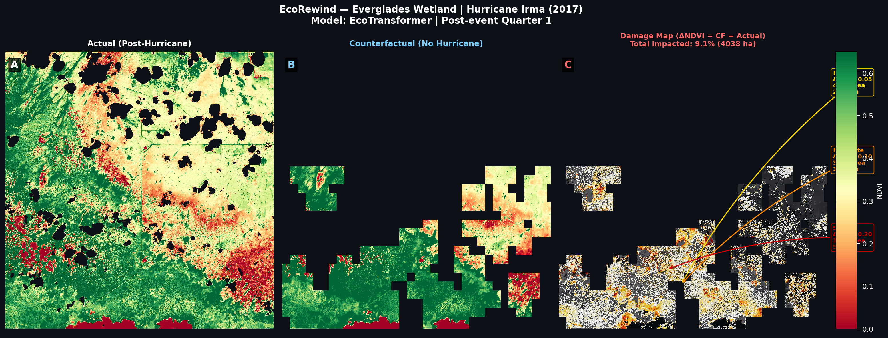
<sub><b>Everglades · EcoTransformer.</b> Observed post-Irma NDVI, the model's no-hurricane counterfactual, and the per-pixel damage map.</sub>
</td>
<td width="50%">
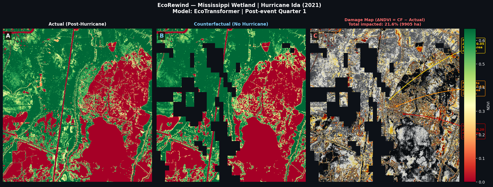
<sub><b>Barataria Bay · EcoTransformer.</b> 21.6% of the scene impacted (9,905 ha) in the first post-Ida quarter.</sub>
</td>
</tr>
<tr>
<td width="50%">
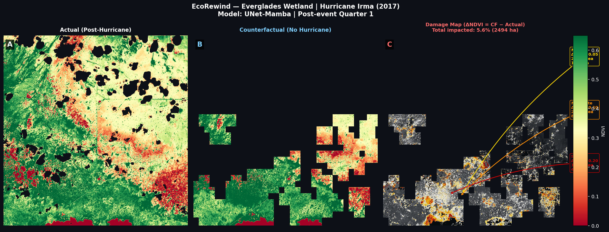
<sub><b>Everglades · UNet-Mamba.</b> Same scene, different backbone — useful as a visual control against the panel above.</sub>
</td>
<td width="50%">
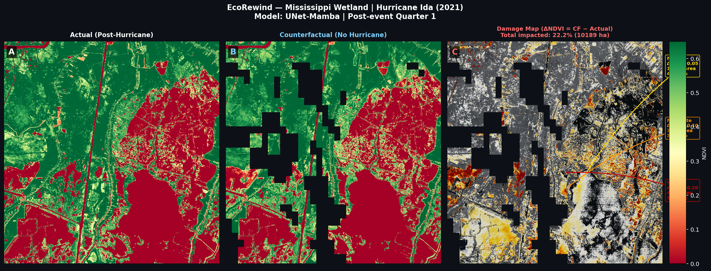
<sub><b>Barataria Bay · UNet-Mamba.</b> Spatial damage pattern is broadly consistent with EcoTransformer here; the aggregate totals are not.</sub>
</td>
</tr>
</table>

### Temporal Evolution — Full Recovery Horizon

<div align="center">

<sub><b>Barataria Bay · EcoTransformer.</b> Row 1: pre-event context fed to the model (t−4 … t−1). Row 2: counterfactual rollout. Row 3: observed. Row 4: per-pixel ΔNDVI. Note the cloud-gap holes propagating through row 1 — the model receives a heavily masked context.</sub>
</div>

<br/>

<table>
<tr>
<td width="50%">
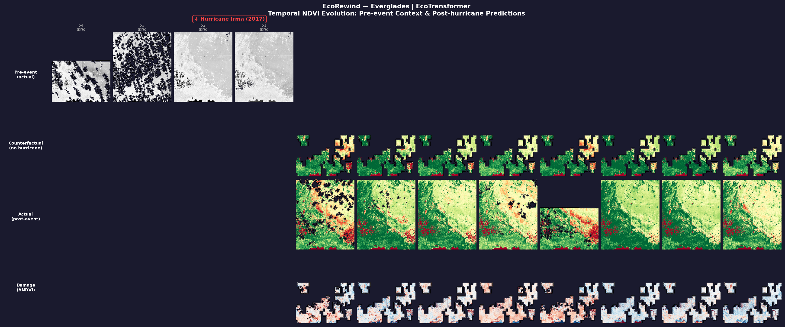
<sub><b>Everglades · EcoTransformer.</b></sub>
</td>
<td width="50%">

<sub><b>Everglades · UNet-Mamba.</b></sub>
</td>
</tr>
<tr>
<td width="50%">

<sub><b>Barataria Bay · UNet-Mamba.</b></sub>
</td>
<td width="50%">
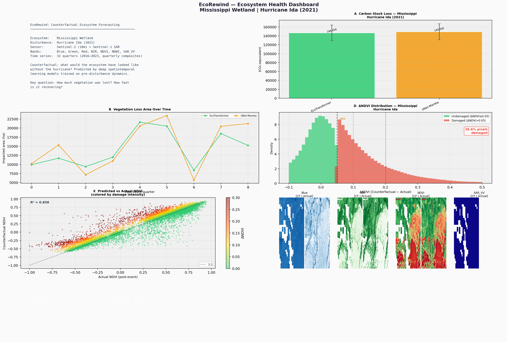
<sub><b>Barataria Bay health dashboard.</b> CF-vs-actual R² = 0.858, 36.6% of pixels damaged. The two converged models agree closely on carbon loss here (146,458 vs 149,006 tCO₂-eq).</sub>
</td>
</tr>
</table>

### Recovery Trajectories & Uncertainty

<table>
<tr>
<td width="50%">
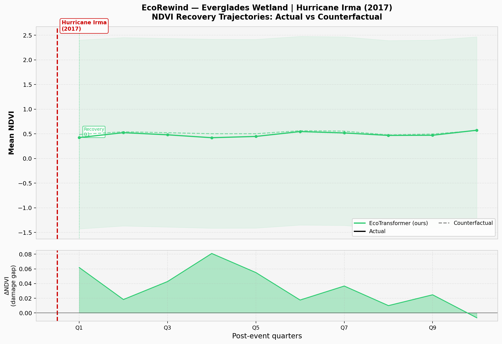
<sub><b>Everglades · UNet-Mamba.</b> Counterfactual (dashed) sits consistently above observed, giving a persistent positive damage gap of 0.02–0.06 NDVI.</sub>
</td>
<td width="50%">
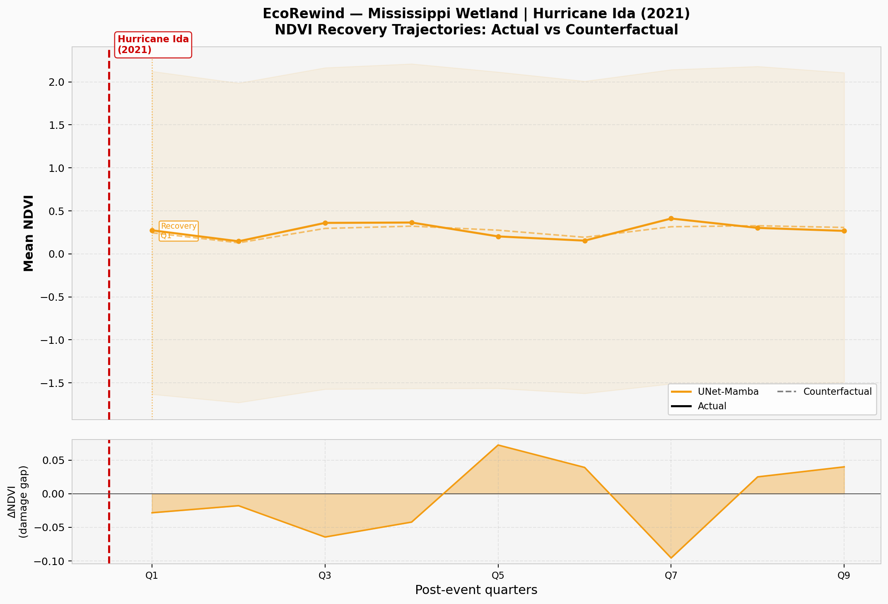
<sub><b>Barataria Bay · UNet-Mamba.</b> The damage gap oscillates in sign across quarters rather than closing monotonically — the direct cause of the broken convergence metric.</sub>
</td>
</tr>
</table>

> [!CAUTION]
> **The shaded MC-Dropout bands in both panels above span roughly ±2.5 NDVI**, far outside the physically possible range of [−1, 1]. The uncertainty estimates are **uncalibrated and not currently usable** — see Limitation 11. The mean trajectories and the ΔNDVI panels are the interpretable parts of these figures.

<div align="center">
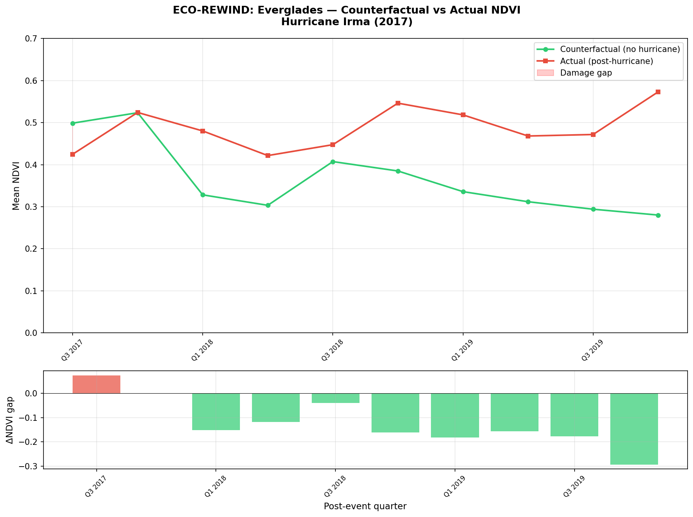
<sub><b>Everglades, calendar-quarter view.</b> The damage gap is positive through 2018 (red, ecosystem below counterfactual) then <b>flips negative</b> from 2019 onward (green, ecosystem above counterfactual). A monotone-recovery assumption cannot describe this, which is why time-to-convergence returns 0.</sub>
</div>

### Ablation Study *(partially broken — shown as-is)*

<div align="center">
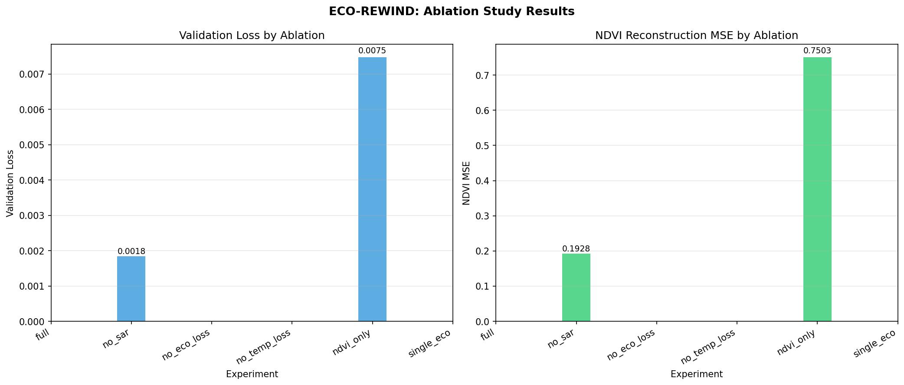
<sub><b>Only 2 of 6 ablation configurations completed.</b> <code>full</code>, <code>no_eco_loss</code>, <code>no_temp_loss</code>, and <code>single_eco</code> all crash on a channel-count mismatch (the model is not rebuilt when input bands are dropped), leaving empty bars. Of what did run: dropping SAR costs little, while NDVI-only input degrades reconstruction MSE ~4× (0.193 → 0.750), indicating the multispectral context carries real predictive signal. This figure is included unretouched because the gap is part of the project's current state.</sub>
</div>

---

## Model Architectures

Five architectures were implemented from scratch (not imported) and benchmarked under identical data, loss, and training schedules.

<details open>
<summary><b>🥇 EcoTransformer</b> — factorized spatiotemporal attention <i>(best performing)</i></summary>

<br/>

`models/eco_transformer.py` · `embed_dim=128, depth=4, heads=8, mlp_ratio=4.0, dropout=0.1`

```mermaid
flowchart LR
    I["Input<br/>(B,T,7,128,128)"] --> SG["SAR Input Gate<br/>learned σ(g), init −3.0"]
    SG --> CI["Channel Importance<br/>Weighting"]
    CI --> PE["Patch embed +<br/>2D sinusoidal pos +<br/>learned temporal emb"]
    PE --> ST["Factorized ST Blocks ×4<br/>spatial attn → temporal attn"]
    ST --> XA["Cross-attention<br/>query tokens (T_out)"]
    XA --> DEC["SSIM-aware decoder"]
    DEC --> CL["Band-wise output clamp<br/>optical [−0.1,1.1] · SAR [−4,4]"]
    CL --> O["Output<br/>(B,T_out,7,128,128)"]

    style ST fill:#8B5CF6,color:#fff
    style SG fill:#F59E0B,color:#fff
```

**Why it wins:** factorizing attention into separate spatial and temporal passes keeps cost at `O(HW·d + T·d)` instead of `O((T·HW)²)`, making full 128×128 attention tractable. The learned **SAR input gate** (initialised at σ(−3.0) ≈ 0.05) lets the model suppress the mostly-invalid SAR channel instead of being corrupted by it — critical given SAR is 87% fill.

</details>

<details>
<summary><b>ConvLSTM</b> — recurrent convolutional baseline</summary>

<br/>

`models/convlstm.py` · `hidden_channels=[96,96,64], kernel=3, dropout=0.1`

Classic Shi et al. encoder–decoder ConvLSTM. Serves as the reference point. Notably it is the **only** model with positive SAR R² (0.173), but collapses on NDVI (0.177) — it tracks raw reflectance bands well while failing on the derived index that actually matters.

</details>

<details>
<summary><b>UNet-Temporal</b> — U-Net encoder + LSTM bottleneck + attention</summary>

<br/>

`models/unet_temporal.py` · `encoder=[32,64,128,256], lstm_hidden=512, heads=8`

Spatial U-Net encoder, temporal LSTM at the bottleneck with multi-head attention over the sequence, skip connections into the decoder. **Failed to produce finite evaluation metrics** — joint eval is NaN across all bands. Its counterfactuals are numerically finite but wildly overestimate damage (698k tCO₂), consistent with an unstable rollout.

</details>

<details>
<summary><b>UNet-Mamba</b> — state-space model bottleneck</summary>

<br/>

`models/unet_mamba.py` · `d_state=16, expand=2, n_layers=2, dropout=0.15, lr=1e-5`

Replaces the LSTM bottleneck with Mamba selective state-space blocks for linear-time sequence modelling. **Diverged** despite a reduced learning rate — R² −3.5 on NDVI, −680 on blue. The blue-band collapse suggests the SSM latched onto a near-constant output for low-variance channels. Its *spatial* damage patterns nonetheless remain broadly plausible (see gallery), which is itself a caution: visually reasonable maps do not imply a converged model.

</details>

<details>
<summary><b>UNet-PatchTST</b> — patch-based temporal transformer bottleneck</summary>

<br/>

`models/unet_patchtst.py` · `patch_len=2, stride=1, layers=3, heads=4, lr=2e-5`

PatchTST-style channel-independent temporal patching at the U-Net bottleneck. **Diverged** (NDVI R² −7.4). With only `T_in=4` timesteps, `patch_len=2` leaves 3 temporal tokens — almost certainly too few for the patching inductive bias to pay off.

</details>

---

## Design Decisions

The interesting engineering in this project is mostly in the failures that were diagnosed and fixed. Each of these was a real bug found by inspecting bad numbers.

<details open>
<summary><b>🐛 Per-band validity masking</b> — fixed R² = −89 on SAR</summary>

<br/>

**Symptom:** NDVI R² = −2.27, SAR R² = −89.8. All bands reported identical valid-pixel counts (347,677,067) — including SAR, which should show ~44M.

**Root cause** (`training/evaluator.py`): the evaluator broadcast the single *optical* validity channel across all seven bands via `validity.expand_as(target)`. SAR is 87.5% **finite zero fill**, not NaN — so it passed the optical mask. R² was then computed as `1 − Σ(pred − 0)² / Σ(0 − mean)²`, where the denominator collapses toward zero. Hence R² in the −90s.

**Fix:** per-band validity. Optical bands use the optical channel; SAR uses `(|target_sar| > 0.05) AND optical_valid`, since genuine backscatter is never exactly zero. Switched to single-pass **Welford** online mean/variance so no stale batch mean contaminates the total sum of squares.

</details>

<details open>
<summary><b>🐛 Band-aware NaN fill</b> — fixed a catastrophic NDVI bias</summary>

<br/>

**Symptom:** models systematically under-predicting vegetation.

**Root cause** (`datasets/eco_dataset_patch.py`): a universal `fill=0.0` was applied to invalid pixels in *normalised* space. For minmax-normalised optical bands, 0.0 is a plausible neutral value. But NDVI uses `shift` normalisation, where **0.0 decodes to NDVI = −1** — the physical extreme of bare water. Every cloud-gap pixel looked to the model like maximally dead vegetation.

**Fix:** per-band fill values computed in normalised space so that each band's fill decodes to its physical neutral point.

</details>

<details>
<summary><b>🌡️ Seasonal climatology floor</b> — stops autoregressive drift</summary>

<br/>

A 10-quarter autoregressive rollout compounds error. Early counterfactuals drifted monotonically downward — a predicted winter dip became the next input, producing a deeper dip, until the trajectory bottomed out and never recovered.

**Fix** (`inference/counterfactual.py`): clamp each rollout step to `μ − 2σ` of the pre-event statistics *for that same calendar quarter*. Seasonality is preserved; unbounded drift is not. Configurable via `inference.climatology_sigma`.

</details>

<details>
<summary><b>📉 Composite domain-constrained loss</b></summary>

<br/>

`models/losses.py` — `EcoRewindLoss`:

| Term | Weight | Purpose |
|---|---|---|
| **Charbonnier** reconstruction | 1.0 | Robust L1/L2 hybrid, `ε=1e-2` — tolerant of outlier pixels from residual cloud |
| **Temporal smoothness** | 0.20 | Penalises implausible quarter-to-quarter jumps |
| **Ecological constraints** | 0.10 | Hard physical bounds: NDVI/NDWI ∈ [−1,1], reflectance ∈ [0,1] |
| **SSIM** | 0.10 | Structural fidelity — spatial pattern, not just per-pixel error |

SSIM is **linearly warmed up over 20 epochs** (`ssim_warmup_epochs`). Applied from epoch 0 it dominates gradients before the model produces coherent structure, and training stalls. Auxiliary weights were re-scaled in v3 after the reconstruction term was corrected to per-pixel scale (~0.3) — at the old weights the auxiliary terms contributed negligible gradient.

</details>

<details>
<summary><b>🎲 MC Dropout uncertainty</b></summary>

<br/>

50 stochastic forward passes with dropout active at inference give a per-pixel mean and standard deviation, motivated by the fact that a point-estimate counterfactual invites false precision on a quantity that can never be verified. **In its current form the resulting intervals are not calibrated** (Limitation 11) — the machinery works, the variance scaling does not.

</details>

<details>
<summary><b>🔬 Patch sampling & validity screening</b></summary>

<br/>

128×128 patches at stride 64, with rejection criteria: `nan_threshold=0.15`, `min_valid_coverage=0.30`, `ndvi_var_threshold=5e-4` (rejects flat/degenerate patches), `min_high_signal_frac=0.40`. Balanced sampling across ecosystems so the larger site does not dominate joint training.

</details>

---

## Data Pipeline

| Property | Value |
|---|---|
| **Sensors** | Sentinel-2 SR (optical) + Sentinel-1 GRD (C-band SAR) |
| **Bands** | Blue, Green, Red, NIR, NDVI, NDWI, SAR_VV |
| **Resolution** | 10 m |
| **Temporal** | 32 quarterly median composites, 2016 Q1 → 2023 Q4 |
| **Normalisation** | minmax (optical) · shift (NDVI/NDWI) · z-score (SAR) |
| **Windows** | `T_in=4 → T_out=4` sliding |
| **Split** | 85 / 15 patch-level, seeded |

Quarterly *median* compositing is the key preprocessing choice: it suppresses transient cloud and speckle while retaining the seasonal cycle that the counterfactual depends on. Quarters known to be degraded are flagged per-site in `configs/config.yaml` (`poor_quarters`, `fair_quarters`, `interpolated_quarters`).

Barataria Bay required a **v2 re-export** — the v1 AOI landed on open water (NDVI ≈ −0.02 to 0.05, i.e. mud flat rather than *Spartina* marsh). `scripts/validate_mississippi_v2.py` encodes the acceptance criteria used to catch that class of error before burning GPU time on it.

---

## Repository Structure

```
EcoRewind/
├── configs/
│   └── config.yaml                  # single source of truth: sites, bands, models, loss, training
├── data/
│   ├── loaders/composite_loader.py  # GeoTIFF → array, cloud/NaN handling
│   └── preprocessing/
│       ├── tensor_builder.py        # (T, C, H, W) construction + hurricane-signal sanity check
│       ├── normalizer.py            # per-band strategies + inverse transforms
│       ├── validity_mask.py         # per-band validity computation
│       └── patch_sampler.py         # 128×128 sampling, rejection criteria, windowing
├── datasets/
│   ├── eco_dataset.py               # windows, augmentation, train/val dataloaders
│   └── eco_dataset_patch.py         # band-aware fill, NaN diagnostics
├── models/
│   ├── eco_transformer.py           # ⭐ factorized spatiotemporal attention
│   ├── convlstm.py                  # recurrent baseline
│   ├── unet_temporal.py             # U-Net + LSTM + attention
│   ├── unet_mamba.py                # U-Net + selective SSM
│   ├── unet_patchtst.py             # U-Net + patch temporal transformer
│   └── losses.py                    # EcoRewindLoss composite objective
├── training/
│   ├── trainer.py                   # AMP, grad accumulation, warmup, early stopping, W&B
│   └── evaluator.py                 # per-band validity-masked R² (Welford)
├── inference/
│   ├── counterfactual.py            # autoregressive rollout + MC Dropout + climatology floor
│   └── metrics.py                   # impacted area, carbon loss, recovery, convergence
├── visualization/maps.py
├── scripts/
│   ├── 01_build_tensors.py          # data → tensors
│   ├── 02_train_convlstm.py         # per-model training entrypoints
│   ├── 03_train_unet.py
│   ├── 07_train_eco_transformer.py
│   ├── 08_train_unet_mamba.py
│   ├── 09_train_unet_patchtst.py
│   ├── train_all.py                 # full benchmark sweep
│   ├── 04_generate_counterfactual.py
│   ├── 04b_generate_all_counterfactuals.py
│   ├── 05_compute_metrics.py        # ecological attribution metrics
│   ├── 06_ablation.py               # ⚠️ partially broken — see Limitations
│   └── viz_01…05_*.py               # publication figures
└── outputs/
    ├── metrics/                     # all quantitative results (JSON/CSV)
    ├── maps/publication/            # figures used in this README
    └── logs/
```

---

## Getting Started

### Install

```bash
git clone https://github.com/DAISHINKAN7/EcoRewind.git
cd EcoRewind
python -m venv venv && source venv/bin/activate
pip install -r requirements.txt
```

### Configure

Point `configs/config.yaml` at your data root:

```yaml
data:
  mode: "local"
  local_root: "/path/to/EcoRewind_Data"   # ← edit this
```

Expected layout — quarterly 7-band GeoTIFFs per site:

```
EcoRewind_Data/
├── Everglades/       # 32 quarterly composites
└── Mississippi_v2/   # 32 quarterly composites
```

> [!NOTE]
> The Google Earth Engine export script is **not yet committed** — see [Roadmap](#roadmap). Until it is, reproducing from raw imagery requires re-deriving the GEE export. `scripts/validate_mississippi_v2.py` documents the acceptance criteria your export must satisfy.

### Run

```bash
# 1 · Build tensors from GeoTIFFs
python scripts/01_build_tensors.py

# 2 · Train (single model, or full sweep)
python scripts/07_train_eco_transformer.py
python scripts/train_all.py

# 3 · Generate counterfactuals
python scripts/04b_generate_all_counterfactuals.py

# 4 · Compute ecological attribution metrics
python scripts/05_compute_metrics.py

# 5 · Publication figures
python scripts/viz_01_damage_comparison.py
python scripts/viz_02_recovery_trajectories.py
python scripts/viz_03_model_comparison.py
python scripts/viz_04_temporal_evolution.py
python scripts/viz_05_ecosystem_health_dashboard.py
```

Training config: 150 epochs max, batch size 4 with 4× gradient accumulation (effective 16), LR 3e-5 with 15-epoch warmup, early stopping patience 30, gradient clipping 1.0. W&B logging is on by default (`wandb.enabled`).

---

## Known Limitations

This section is deliberately detailed. The failure modes below are known, measured, and unresolved — they define what this prototype is not.

> [!CAUTION]
> **1 · The counterfactual is never validated.** This is the central scientific gap. No placebo test exists in the repository. The standard remedy — roll the model forward across a *quiet, non-hurricane* window and score the "counterfactual" against actually-observed data — has not been run. Until it is, every damage and carbon figure here is an unvalidated model output, not a measurement.

> [!CAUTION]
> **2 · Attribution estimates are architecture-dominated.** Carbon loss varies >20× across backbones on identical inputs (see [table](#attribution-sensitivity--the-headline-finding)). No single figure from this pipeline should be quoted as an estimate of real-world damage.

**3 · Spatial leakage in the validation split.** Patches are 128 px at stride 64 (50% overlap) and split by patch-level random shuffle (`datasets/eco_dataset.py`). Train and validation patches share pixels. All reported R² values are optimistic upper bounds. Fix: split on disjoint spatial blocks, or use stride ≥ 128.

**4 · No held-out test set.** The validation split serves double duty for early stopping and for reporting. Reported metrics are therefore selection-biased.

**5 · Three of five architectures diverged.** UNet-Temporal produces NaN metrics; UNet-Mamba and UNet-PatchTST have strongly negative R². Root causes are hypothesised above but not confirmed.

**6 · The ablation study is broken.** Four of six experiments crash with a channel-count mismatch (`expected 72 channels, got 66/71`) — the model is not rebuilt when input bands are dropped. Only `no_sar` and `ndvi_only` completed, as the empty bars in the [ablation figure](#ablation-study-partially-broken--shown-as-is) show. Conclusions about loss-term contributions cannot currently be drawn.

**7 · SAR contributes nothing.** Negative R² for every converged model. With 87.2% zero fill, the band is effectively noise. It should either be repaired (proper fill handling, temporal interpolation) or dropped with justification.

**8 · Carbon conversion is a coarse linear proxy.** `carbon_factor: 85.0` tCO₂ per unit ΔNDVI per hectare is a single global constant applied uniformly across marsh, mangrove, and open water. Real carbon density varies by an order of magnitude across those classes. Treat tCO₂ figures as relative indices, not absolute inventories.

**9 · Convergence detection is unreliable.** `time_to_convergence_quarters = 0` for every model in panel E of the comparison figure, because the CF–actual gap oscillates in sign rather than closing monotonically — clearly visible in the [calendar-quarter trajectory](#recovery-trajectories--uncertainty), where the gap is positive through 2018 and negative from 2019. The metric assumes monotone recovery, which the data does not exhibit.

**10 · MC-Dropout intervals are uncalibrated.** The shaded bands in the trajectory figures span roughly **±2.5 NDVI**, exceeding the physical range of the index by more than an order of magnitude. Dropout variance in normalised space is evidently not being scaled correctly on inverse-transform. The intervals should not be read as confidence bounds until this is fixed.

**11 · Reproducibility gaps.** The GEE export script is uncommitted; `configs/config.yaml` retains a hardcoded absolute path from the development machine; there is no test suite; checkpoints are gitignored. An early run also overwrote a metrics file under the wrong model name (see the provenance note in Results).

---

## Roadmap

Ordered by scientific value per unit effort.

- [ ] **Placebo validation** — roll counterfactuals over quiet pre-event windows, score against observed. *The single highest-value experiment; converts the method from unfalsifiable to validated.*
- [ ] **Disjoint spatial-block splits** — re-report all R² without pixel leakage.
- [ ] **Fix the ablation harness** — rebuild the model per band configuration so all six experiments run.
- [ ] **Calibrate MC-Dropout intervals** — trace the variance through inverse-normalisation; add a coverage check against held-out data.
- [ ] **Held-out test set** distinct from the early-stopping split.
- [ ] **Diagnose the three divergent architectures** — LR sweeps, per-term loss logging, gradient-norm traces.
- [ ] **Repair or remove SAR** — temporal interpolation over the 87% gap, or drop with justification.
- [ ] **Replace the convergence metric** with one that tolerates non-monotone recovery.
- [ ] **Land-cover-aware carbon factors** replacing the single global constant.
- [ ] **Commit the GEE export script** + de-hardcode paths.
- [ ] **📊 Interactive web report** — a deployable site presenting architectures, design decisions, and results with an explorable counterfactual map (site / band / quarter selectors, split-view actual-vs-counterfactual, model switcher). Scoped in `PORTFOLIO_PLAN.md`.

---

## Citation

```bibtex
@software{ajgaonkar_ecorewind_2026,
  author = {Ajgaonkar, Kunal},
  title  = {EcoRewind: Counterfactual Ecosystem Forecasting for
            Hurricane Impact Attribution},
  year   = {2026},
  url    = {https://github.com/DAISHINKAN7/EcoRewind}
}
```

### Related Work

- Shi et al. (2015) — *Convolutional LSTM Network: A Machine Learning Approach for Precipitation Nowcasting*
- Gu & Dao (2023) — *Mamba: Linear-Time Sequence Modeling with Selective State Spaces*
- Nie et al. (2023) — *A Time Series is Worth 64 Words: Long-term Forecasting with Transformers* (PatchTST)
- Gao et al. (2022) — *Earthformer: Exploring Space-Time Transformers for Earth System Forecasting*

---

<div align="center">

**Kunal Ajgaonkar** · Symbiosis Institute of Technology, Pune

Built with Sentinel-1/2 imagery via Google Earth Engine. Copernicus data © ESA.

<sub>Research prototype. Results are not validated for operational or policy use — see <a href="#known-limitations">Known Limitations</a>.</sub>

</div>
